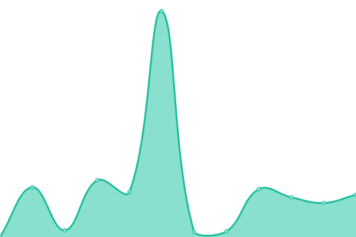
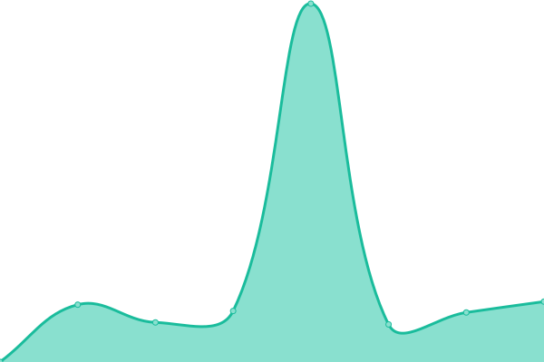

# [📈 Live Status](https://Radiquum.github.io/wah.su-uptime): <!--live status--> **🟧 Partial outage**

This repository contains the open-source uptime monitor and status page for [Kentai Radiquum](https://pawb.cf), powered by [Upptime](https://github.com/upptime/upptime).

With [Upptime](https://upptime.js.org), you can get your own unlimited and free uptime monitor and status page, powered entirely by a GitHub repository. We use [Issues](https://github.com/Radiquum/wah.su-uptime/issues) as incident reports, [Actions](https://github.com/Radiquum/wah.su-uptime/actions) as uptime monitors, and [Pages](https://Radiquum.github.io/wah.su-uptime) for the status page.

<!--start: status pages-->
<!-- This summary is generated by Upptime (https://github.com/upptime/upptime) -->
<!-- Do not edit this manually, your changes will be overwritten -->
<!-- prettier-ignore -->
| URL | Status | History | Response Time | Uptime |
| --- | ------ | ------- | ------------- | ------ |
|  [Auth](https://auth.wah.su) | 🟩 Up | [auth.yml](https://github.com/Radiquum/wah.su-uptime/commits/HEAD/history/auth.yml) | 

 1657ms
     
 | 

<a href="https://status.wah.su/history/auth">62.26%</a>
    

|  Cloud | 🟩 Up | [cloud.yml](https://github.com/Radiquum/wah.su-uptime/commits/HEAD/history/cloud.yml) | 

 918ms
     
 | 

<a href="https://status.wah.su/history/cloud">62.26%</a>
    

|  [Vault](https://vault.wah.su) | 🟩 Up | [vault.yml](https://github.com/Radiquum/wah.su-uptime/commits/HEAD/history/vault.yml) | 

 754ms
     
 | 

<a href="https://status.wah.su/history/vault">62.26%</a>
    

|  [Search](https://search.wah.su) | 🟩 Up | [search.yml](https://github.com/Radiquum/wah.su-uptime/commits/HEAD/history/search.yml) | 

 736ms
     
 | 

<a href="https://status.wah.su/history/search">62.26%</a>
    

|  Minecraft ZeroTier Server | 🟥 Down | [minecraft-zero-tier-server.yml](https://github.com/Radiquum/wah.su-uptime/commits/HEAD/history/minecraft-zero-tier-server.yml) | 

 2970ms
     
 | 

<a href="https://status.wah.su/history/minecraft-zero-tier-server">37.82%</a>
    

<!--end: status pages-->

[**Visit our status website →**](https://Radiquum.github.io/wah.su-uptime)

## 📄 License

- Powered by: [Upptime](https://github.com/upptime/upptime)
- Code: [MIT](./LICENSE) © [Kentai Radiquum](https://pawb.cf)
- Data in the `./history` directory: [Open Database License](https://opendatacommons.org/licenses/odbl/1-0/)
